# launch_main.py Connection Map

This document maps the current runtime structure connected to `One_Stop_Shop/launch_main.py`, including Python modules and JSON data files used directly or transitively by the app.

## 1) Entry Point

- `One_Stop_Shop/launch_main.py`
  - Adds `One_Stop_Shop` to `sys.path`
  - Imports `OneStopShopMain` from `One_Stop_Shop/one_stop_shop_main.py`
  - Instantiates and runs main GUI app

## 2) High-Level Runtime Graph

```mermaid
flowchart TD
    A[launch_main.py] --> B[one_stop_shop_main.py / OneStopShopMain]

    B --> C[Core/account_workflow_manager.py]
    B --> D[Core/language_normalizer.py]
    B --> E[Core/service_mapper.py]
    B --> F[Core/quoteme_value_mapper.py]
    B --> G[Core/pa_template_manager.py]
    B --> H[Core/pa_template_processor.py]
    B --> I[Core/quoteme_email_parser.py]
    B --> J[One_Stop_Shop/quoteme_parser_ui.py]

    B --> K[Core/WF_Matrix.py]
    B --> L[Core/sync_entities.py]
    B --> M[Core/entity_service_mapper.py]

    B --> N[One_Stop_Shop/gui/entity_manager_gui.py]
    B --> O[One_Stop_Shop/gui/workflow_manager_gui.py]
    B --> P[One_Stop_Shop/gui/service_mapping_gui.py]

    N --> K
    N --> M
    O --> C
    O --> E
    P --> M
    P --> K

    B --> Q[One_Stop_Shop/launch_entity_manager.py]
    B --> R[One_Stop_Shop/launch_workflow_manager.py]
    B --> S[CEVA_Launcher/KickOff.py]
```

Notes:
- `Q` and `R` are launched by subprocess from the main app in specific actions.
- `S` is loaded dynamically for automation kickoff.

## 3) Python Files Connected to launch_main.py

### 3.1 Direct runtime chain

- `One_Stop_Shop/launch_main.py`
- `One_Stop_Shop/one_stop_shop_main.py`

### 3.2 Core modules imported by the main app

- `Core/pa_template_manager.py`
- `Core/pa_template_processor.py`
- `Core/quoteme_email_parser.py`
- `Core/account_workflow_manager.py`
- `Core/language_normalizer.py`
- `Core/service_mapper.py`
- `Core/quoteme_value_mapper.py`
- `Core/WF_Matrix.py` (loaded/reloaded and persisted)
- `Core/sync_entities.py` (called to align entity services to TPUS)
- `Core/entity_service_mapper.py` (entity-to-master service mapping)

### 3.3 One_Stop_Shop modules used by the main app

- `One_Stop_Shop/quoteme_parser_ui.py`
- `One_Stop_Shop/gui/entity_manager_gui.py`
- `One_Stop_Shop/gui/workflow_manager_gui.py`
- `One_Stop_Shop/gui/service_mapping_gui.py`
- `One_Stop_Shop/launch_entity_manager.py` (subprocess launcher)
- `One_Stop_Shop/launch_workflow_manager.py` (subprocess launcher)

### 3.4 External/sibling Python dependencies referenced by main app

- `CEVA_Launcher/KickOff.py` (dynamic import for kickoff action)
- `Rate_Card_Builder/rate_card_builder_integrated.py` (optional import)
- `Rate_Card_Builder` JSON rate card files are scanned/loaded by name pattern

## 4) JSON Files Connected to launch_main.py

## 4.1 Core JSON files directly read/written by main app or imported runtime modules

- `Core/column_preferences.json`
  - UI column visibility and order preferences.
- `Core/job_data_config.json`
  - Job Data table configuration.
- `Core/master_rate_cards.json`
  - Central persisted rate-card definitions.
- `Core/accounts_workflows.json`
  - Accounts/workflows structure (via `AccountWorkflowManager`).
- `Core/entity_services.json`
  - Entity service tables, also updated by entity manager GUI.
- `Core/canonical_services.json`
  - Canonical service names used for normalization.
- `Core/service_mappings.json`
  - Entity service mapping store used by `EntityServiceMapper`.
- `Core/language_mapping.json`
  - Custom language normalization mappings.
- `Core/languages_iso_codes.json`
  - ISO language catalog for normalization.
- `Core/service_classification.json`
  - Service classification used by QuoteMe value logic.
- `Core/pa_template_configs.json`
  - PA template configuration store.

## 4.2 Account-scoped JSON files used in runtime

- `Core/accounts/<ACCOUNT>/quoteme_mappings.json`
  - QuoteMe field-to-service mapping per account.
- `Core/accounts/<ACCOUNT>/fee_service_defaults.json`
  - Fee defaults and minimum behaviors per account.
- `Core/accounts/<ACCOUNT>/currency_conversions.json`
  - Currency conversion settings per account.
- `Core/accounts/<ACCOUNT>/service_mappings/<RATE_CARD>.json`
  - Account/rate-card service-to-canonical mapping.
- `Core/accounts/<ACCOUNT>/min_fee_thresholds/<RATE_CARD>.json`
  - Minimum fee thresholds per account/rate card.

## 4.3 Entity alias JSON files

- `Core/entity_service_aliases/<ENTITY>.json`
  - Canonical-to-entity alias naming per entity.

## 4.4 Rate card JSON files consumed by main app

- `Rate_Card_Builder/rate_cards_*.json`
  - Detected and loaded when selecting rate cards.

## 4.5 JSON in One_Stop_Shop folder that is NOT in the current launch_main runtime path

- `One_Stop_Shop/workflows.json`
- `One_Stop_Shop/service_label_mapping.json`

These are associated with legacy/alternate flows (for example older app scripts like `theonebp_app.py`) and are not the primary source of truth for the current `launch_main.py -> one_stop_shop_main.py` flow.

## 5) Current Logic Structure (Simplified)

1. App starts from `launch_main.py` and constructs `OneStopShopMain`.
2. `OneStopShopMain.__init__` initializes managers:
   - accounts/workflows, language normalization, service normalization, QuoteMe value mapping, PA templates.
3. Startup normalization runs:
   - TPUS in `WF_Matrix.py` is aligned to canonical services.
   - `sync_entities.py` propagates missing TPUS services to other entities.
4. Configuration tab embeds entity/workflow/service mapping GUIs.
5. Job Data tab uses selected account/workflow/entity to build LP-by-service table.
6. Export path resolves entity-aware service names + SG1/SG2/UofM and writes charges CSV.
7. User edits in configuration views persist to Core JSON files and, for entity tables, to `WF_Matrix.py` + `entity_services.json`.

## 6) Practical Impact of the Current Architecture

- `WF_Matrix.py` remains a live Python data source for entity service tables.
- Canonical control and normalization are JSON-driven (`canonical_services.json`, mapping files, aliases).
- Account behavior is mostly data-driven under `Core/accounts/<ACCOUNT>/...`.
- Main runtime path is centered in `one_stop_shop_main.py`; alternate launch scripts are secondary tools.

---

If needed, this map can be extended with a function-level map (method-to-file dependency matrix) for `one_stop_shop_main.py`.